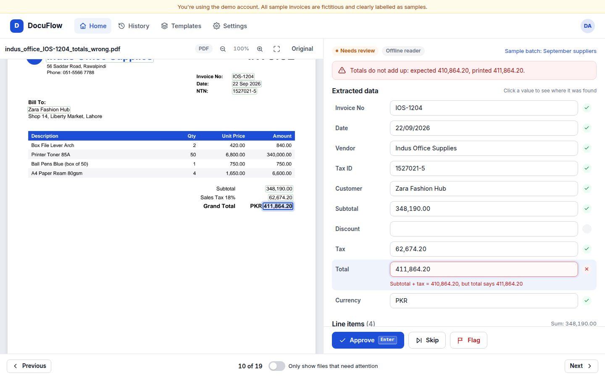
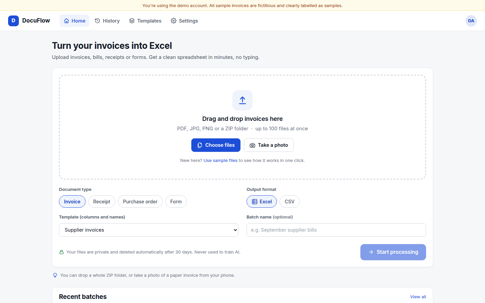
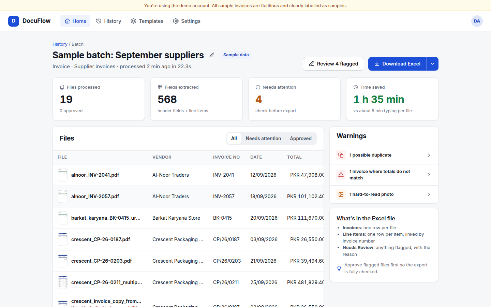
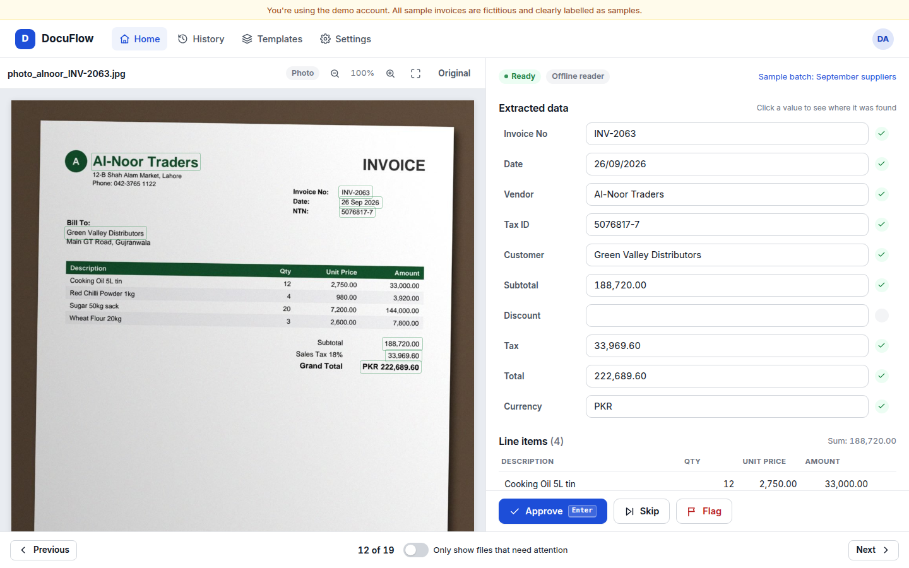
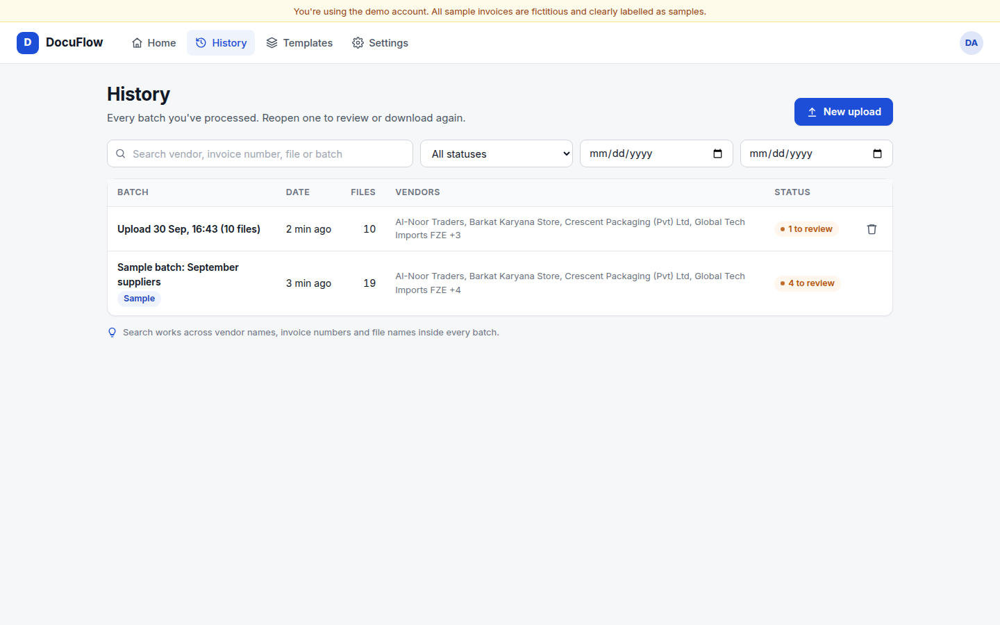
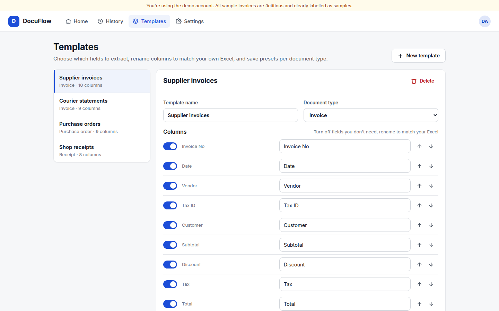
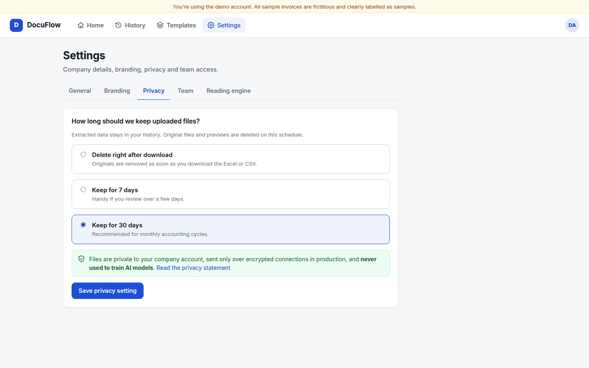
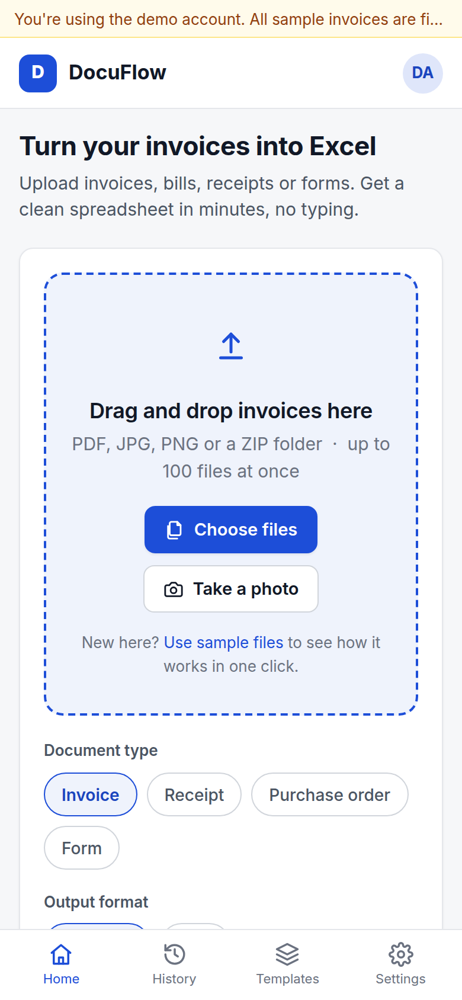

# DocuFlow: Invoice & Document Extractor

**Upload your invoices, bills and forms. In minutes you get a clean Excel sheet, no typing.**

Invoices, receipts, purchase orders and forms (PDF, scanned copy or phone photo) go in. Every important detail comes out in a tidy table, checked, and downloadable as Excel or CSV.



## What it does

| | |
|---|---|
| **Reads anything** | Text PDFs, scanned PDFs, phone photos, multi-page invoices, Urdu-English bills, whole ZIP folders (up to 100 files per batch) |
| **Extracts** | Invoice no, date, vendor, tax ID (NTN/STRN/VAT), customer, subtotal, discount, tax, total, currency, and every line item |
| **Checks every value** | Re-adds totals, detects duplicates (also against earlier batches), flags blurry photos, marks uncertain fields orange and problems red |
| **Human review** | Split screen: original on the left with the exact spot highlighted, editable data on the right. <kbd>Enter</kbd> approves, arrows move |
| **Exports** | Excel with 3 sheets (Invoices, Line Items, Needs Review) or CSV, in the client's own column names, order and date format |
| **For teams** | History with search, reusable templates, admin/reviewer roles, white-label logo and colour, English/Urdu labels, auto-deletion of files |

Works on laptop and phone (take a photo of an invoice and upload it directly).

## Screens

| Home / Upload | Batch summary | Review |
|---|---|---|
|  |  |  |
| **History** | **Templates** | **Settings / Privacy** |
|  |  |  |

Mobile: 

## Measured results

Measured by `scripts/evaluate.py` on the 19 fictitious sample documents (offline reader, no AI key):

| Metric | Result |
|---|---|
| Field accuracy, readable documents | **99.4%** |
| Field accuracy, all 19 (incl. a deliberately blurry photo) | 95.3% |
| Documents fully correct without edits | 17 / 19 |
| Average time per document | 1.4 s |
| Wrong totals caught / blurry photo flagged | 1 / 1, 1 / 1 |

Full breakdown in [docs/results.md](docs/results.md). **Be honest with clients:** the offline reader was built around these sample layouts, so real-world documents will score lower. Always run the same script on 20-50 of the client's own documents before quoting numbers.

## Quick start

```bash
./run.sh
```
Open http://localhost:8001 and click **Try with sample invoices**. The first run creates a virtual environment and installs packages (a few minutes).

- Demo login: `demo@docuflow.app` / `demo1234`
- Landing page: http://localhost:8001/landing
- Privacy statement: http://localhost:8001/privacy

Requirements: Python 3.10+. Nothing else. OCR runs offline through a pip package.

## Turning on AI reading (Groq, free)

Without a key, DocuFlow uses its **offline reader** (PDF text layer + offline OCR + layout rules). It is fast and private, and handles common invoice layouts.

For messy or unusual layouts, add a free Groq key:

1. Create a key at https://console.groq.com/keys
2. Put it in `.env`:
   ```
   GROQ_API_KEY=gsk_your_key_here
   ```
3. Restart `./run.sh`. Settings → Reading engine now shows **AI reading is on**.

Text PDFs go to `llama-3.3-70b-versatile`; photos and scans go to the vision model `meta-llama/llama-4-scout-17b-16e-instruct` (change them in `.env` if Groq renames models). If a Groq call fails (rate limit, network), that document automatically falls back to the offline reader and says so on the review screen. Run `python -m scripts.evaluate` again with the key set to measure AI accuracy.

## Free live demo links

### GitHub Codespaces (free, all features)

[](https://codespaces.new/daniyal-nawaz97/docuflow-invoice-extractor?quickstart=1)

1. Click the button above (or **Code → Codespaces → Create codespace on main**).
2. Wait about 3–5 minutes the first time while it installs; the app starts by itself on port 8001.
3. Open the **Ports** tab, check port 8001 shows **Public** (right-click → Port visibility → Public if not), and copy its address. It looks like `https://<name>-8001.app.github.dev`. Send that link to the client.

Free GitHub accounts get about 60 hours a month on a 2-core machine (30 hours of a running Codespace). A Codespace stops after 30 minutes without activity; **stop it yourself after the meeting** (Codespaces page → ⋯ → Stop) to save hours. Restarting it brings the same link back, with fresh demo data.

### Why not Render's free plan?

Reading photos with OCR needs about 600 MB of memory at peak, more than the 512 MB of Render's free plan. Use Codespaces for free demos, or a small paid server (~$5/month, see **Deploying**) for an always-on link.

## Deploying a live demo link

Any host that runs Docker works (Render, Railway, Fly.io, a VPS):

```bash
docker build -t docuflow .
docker run -p 8001:8001 -v $(pwd)/data:/app/data --env-file .env docuflow
```

On Render: New → Web Service → this repo → Docker. Add `GROQ_API_KEY` as an environment variable and a persistent disk mounted at `/app/data`. The sample batch is created automatically on first start, so the demo is never empty.

## Setting up for a client (white-label)

1. **Settings → Branding**: upload their logo and set their colour.
2. **Settings → General**: company name, currency, date format.
3. **Templates**: rename columns and set the order to match their Excel.
4. **Settings → Team**: add their staff as admins or reviewers.
5. **Settings → Privacy**: agree the retention period with them.
6. Change `DEMO_EMAIL`/`DEMO_PASSWORD` in `.env`, or remove the demo button for private installs.

## Project structure

```
app/
  main.py          FastAPI routes (auth, batches, review, export, templates, settings, team)
  reader.py        PDF text layer / offline OCR -> page images + positioned text
  extract_rules.py Offline extraction (labels, amounts, dates, line items)
  extract_ai.py    Groq extraction (text + vision), used when GROQ_API_KEY is set
  pipeline.py      Read -> extract -> locate -> checks (totals, duplicates, blur) -> save
  exporter.py      Excel (3 sheets) and CSV in the client's format
  presets.py       Fields per document type, reusable templates
static/            Single-page app (no build step), landing page, privacy page
scripts/
  make_samples.py  Regenerate the 19 fictitious sample invoices + ground truth
  evaluate.py      Measure accuracy and speed -> docs/results.md
  record_demo.py   Re-record the demo video automatically (needs playwright)
docs/              Case study, pitch, demo script, one-pager, handover guide, sample output
```

## Client materials (in `docs/`)

- [Demo video](docs/demo.mp4) (1.5 min, captions on screen)
- [One-page PDF](docs/one-pager.pdf) and its source [one-pager.html](docs/one-pager.html)
- [Case study](docs/case-study.md)
- [Pitch messages, follow-ups and objections](docs/pitch-and-outreach.md)
- [Demo video script](docs/demo-video-script.md)
- [Pricing and packages](docs/pricing.md)
- [Onboarding and handover guide](docs/onboarding-and-handover.md)
- [Sample Excel output](docs/sample_output.xlsx) to attach to messages
- [Measured results](docs/results.md)

## Honest limits (tell clients upfront)

- Handwriting and very poor photos reduce accuracy; that's why the review screen exists.
- A person approves flagged items. It's a huge time saver, not magic.
- Not a substitute for tax or accounting advice.
